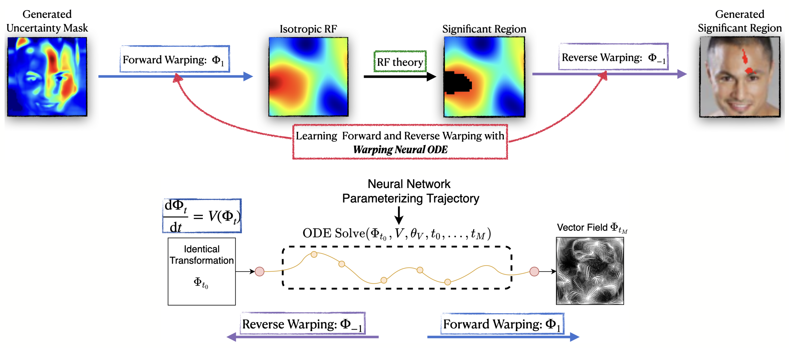

Official repository of the paper (CVPR 2022)  ["Understanding Uncertainty Maps in Vision with Statistical Testing"](https://openaccess.thecvf.com/content/CVPR2022/papers/Nazarovs_Understanding_Uncertainty_Maps_in_Vision_With_Statistical_Testing_CVPR_2022_paper.pdf).

If you like our work, please give us a star. If you use our work in your research projects,
please cite our paper as
```
@inproceedings{nazarovs2022understanding,
  title={Understanding Uncertainty Maps in Vision With Statistical Testing},
  author={Nazarovs, Jurijs and Huang, Zhichun and Tasneeyapant, Songwong and Chakraborty, Rudrasis and Singh, Vikas},
  booktitle={Proceedings of the IEEE/CVF Conference on Computer Vision and Pattern Recognition},
  pages={406--416},
  year={2022}
}
```



# Installation
The `requirements.txt` was generated with `pipreqs --force ./ > requirements.txt`. 
It contains description of packages used for this project.
You can install required packages as `pip install -r requirements.txt`. 
*Note*: requirements.txt was not generated as a copy-slice from conda environment.

In addition, you need to have `R` with following libraries: 
`library(RandomFields)` and `library(reticulate)`.
 

# Running the script
The script procedure is split in 3 parts:
1. Generate appropriate target data
2. Learn how to generate mask on a target data in a supervised way
3. Learn warping from the source data to target data, generate mask,
and do reverse warping.

*Note*: for steps 2 and 3 you need to run the same code `main.py`,
but in different configurations.

## Parameters for the script
There are 2 files, which provide all options to the code.
1. `data_config.py` describes all information about data. If you would like to add 
your own set, you can do it by adding extra `elif`, with corresponding name of your
dataset and parameters: 
- target: path to data and mask. This data is generated by a provided tool above.
- source: path to data, mask as None, and base. 
Where base is a real image, not an uncertainty region. Base is used to plot 
mask on top of it. 
- image size: size of the image, assuming it is squared. It is necessary to define
neural network.

2. `config.py` describes all parameters used for the network. They can be either
changed in that file or provided as argument in the terminal. Examples below.


## 1. Data
To generate target data, namely Gaussian Isotropic RF with significant regions,
you need to run shell script `generate_rf_from_r.sh`. It has 7 parameters, defined
on top of the file. But for personal experiments you mainly need to change: 
- rfType: gauss
- alpha: type - 1 error
- n: number of generated RF
- dimX and dimY: dimension of your uncertainty map
- scale: hyper-parameter, which controls 'blob' size. Plot your RF to make sure that
significant regions and 'blobs' are big enough. Otherwise warping might be difficult

## 2. Learn to generate significant mask for target data
Following description of arguments in `config.py`, main parameters are
- `--data` which is used in `data_config.py` to chose appropriate target data, i.e.
Gaussian isotropic RF, 
- `--experimentID`, which is used later to save the model
- ` --segm_only`, to perform segmentation only and not warping.

You can find other parameters useful to achieve robust segmentation, like 
`--augm` and `--normalize_method`.

*Note*: the learned mask generation can be used for other source data, as long 
as your target data is the same. 

Below is an example of a run.

```python
python3 main.py --n_epochs 5000 --data data-afhq_cat_model-resnet18 --experimentID 64_segm_scale --device 0 --method within --batch_size 256 --n_combine 1 --n_epochs_start_viz 1 --gen_loss_weight 1 --disc_loss_weight 1 --pval_targ 0.95 --gan_type wgan --ode_solver euler  --gen_type vxnet --freq_gen_update 1 --decay_every 100 --lr_gen 0.0001 --lr_disc 0.0001 --ode_vf init_img_y --ode_norm none --plots_path plots/  --rec_loss_weight 0.01 --freq_rec_update 1 --last_warp --jac_loss_weight_forw 1 --jac_loss_weight_back 1 --rec_weight_method default --outgrid_loss_weight_forw 1 --outgrid_loss_weight_back 1 --shuffle --crit_iter 10 --gplambda 10 --disc_optim adam --unet_add_input  --normalize_method scale --segm_only   --augm
```

As a results, the learned model will be saved in `experiments/experiment_64_segm_scale.ckpt_best`.

## 3. Learning warping and generating a significan mask for source data
Now, you can run the same script, but removing flag `--segm_only` and instead 
provide a trained model as a 'mask generator' as
`--load_segm_path experiments/experiment_64_segm_scale.ckpt_best`.

Once model is trained, to perform a test and see generated significant regions,
add following arguments `--load --test_only --n_plots 16 --n_plots_batch 10`. 
This will load the model, and generate up to 16 plots per batch,
and up to 10 batches.
Results should be in the directory `--plots_path`.
